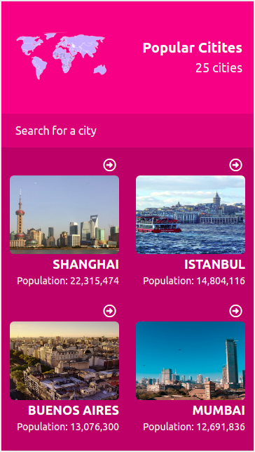
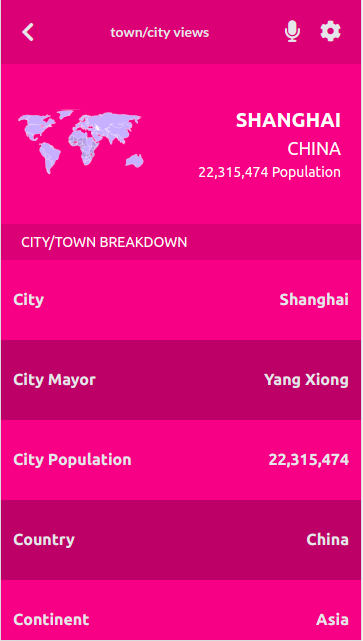

# codate
Codate is an application that gives insight into cities around the world. It enables uses to get understand the best place to live and work based on the cost of living, health care, internet access and some other relevant information. The application uses data from the Teleport Api and makes a meaningful display of the data.

Cities List View                                  |  Single City View                              |
:------------------------------------------------:|:-----------------------------------------------:
                 |               | 

## Online versions
- [Heroku Deployment](https://codate-app.herokuapp.com/)

## Breif descrption video
- [Video](https://www.loom.com/share/1c58acecd71a41e78972028500af4302)

## Built With

- React / Redux

## How to run the program locally
- Clone the project: ```https://github.com/mmsesay/codate.git```
- Skip if you already have node installed otherwise download [nodejs](https://nodejs.org/en/download/) install it on your system
- Install the node modules: ```npm install```
- Run the app: ```npm start``` or ```yarn start```

## How to run the test
- Clone the project: ```https://github.com/mmsesay/codate.git```
- Skip if you already have node installed otherwise download [nodejs](https://nodejs.org/en/download/) install it on your system
- Install the node modules: ```npm install```
- Run the app: ```npm test``` or ```yarn test```

## Author

👤 **Muhammad Mustapha Sesay**

- GitHub: [@mmsesay](https://github.com/mmsesay)
- Twitter: [@DeeMaejor](https://twitter.com/DeeMaejor)
- LinkedIn: [Muhammad M Sesay](https://linkedin.com/in/muhammad-m-sesay)


## 🤝 Contributing

Contributions, issues, and feature requests are welcome!

Feel free to check the [issues page](../../issues/).

## Show your support

Give a ⭐️ if you like this project!

## Acknowledgments
- microverseinc for the readme template
- [Creative Common License of design](https://creativecommons.org/licenses/by-nc/4.0/)
- Original Design by [Nelson Sakwa on Behance](https://www.behance.net/sakwadesignstudio)
- [Teleport Api](https://teleport.org/)